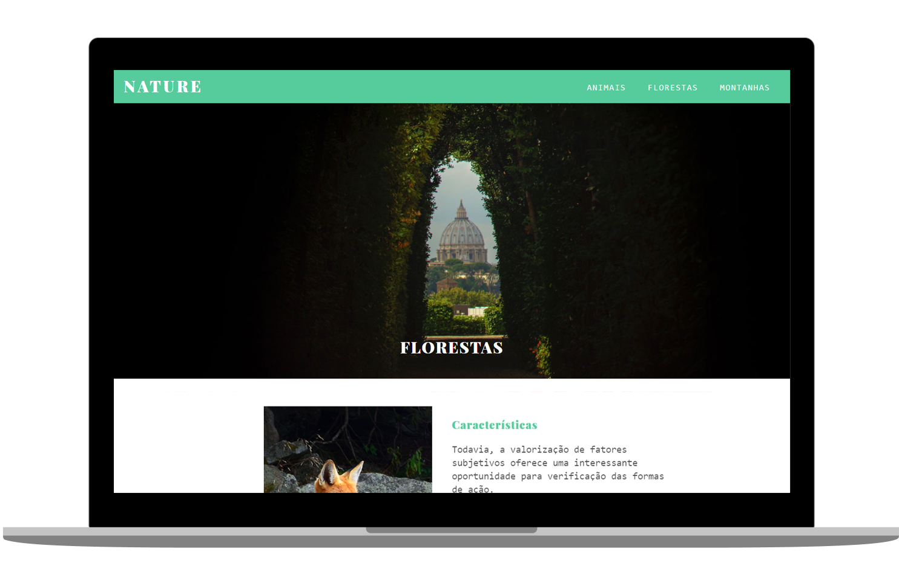

<h1 align="center">
  NATURE
</h1>

   
  
  
  

  

  

## ◾ Projeto

O Nature é um projeto totalmente responsivo feito com jQuery. O principal intuito era solidificar conhecimentos da biblioteca.

#### Visitar o site: [Nature.com](https://www.origamid.com/projetos/nature/)

## ◾ Tecnologias

Esse projeto foi desenvolvido com as seguintes tecnologias:

- [HTML](https://developer.mozilla.org/pt-BR/docs/Web/HTML)
- [CSS](https://developer.mozilla.org/pt-BR/docs/Web/CSS)
- [JQUERY](https://api.jquery.com/)

## ◾ Licença

Esse projeto está sob a licença MIT.

